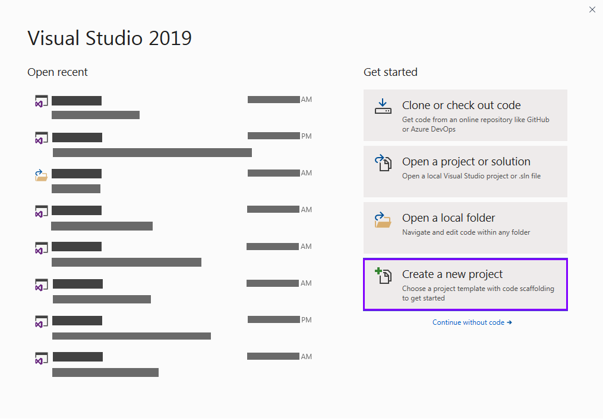
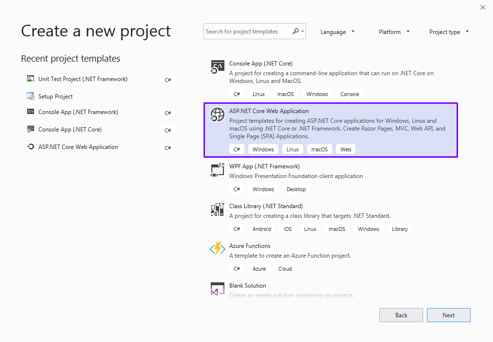
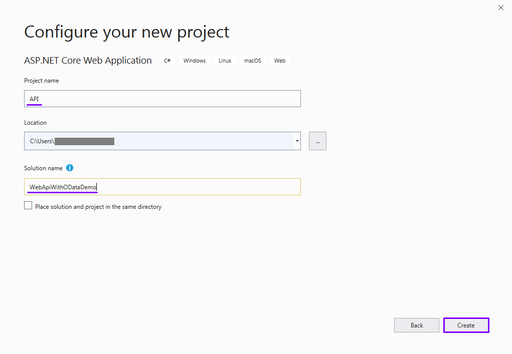
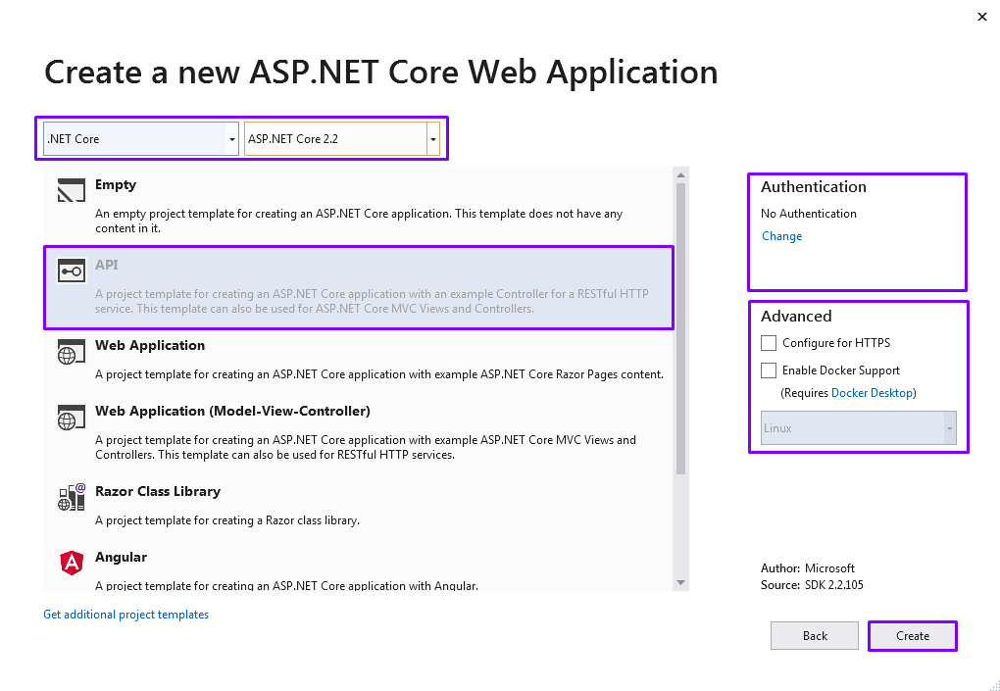

# Inyectando esteroides a tu Web API en .NET Core con OData

Demostración de cómo agregar funcionalidades básicas de consulta a tu Web API con OData en .NET Core

## Paso a paso

## 1. Creando un nuevo proyecto



Selecciona _ASP.NET Core Web Application_ como tipo de proyecto


Indica el nombre del proyecto, el de la solución y la ubicación de la misma.


Selecciona la plantilla _API_ e indicar las características del proyecto


**Navega por el repositorio en este punto de la historia, [aquí](https://github.com/robertlluberes/WebApiWithODataDemo/tree/b39953918d44905ed0e436c8420d4379560aa151)**.

**Puedes ver los cambios específicos en este [commit](https://github.com/robertlluberes/WebApiWithODataDemo/commit/b39953918d44905ed0e436c8420d4379560aa151)**.

## Agregando los modelos

Crea una carpeta llamada _Core_ y dentro de esta, una llamada _Models_, aquí crearemos los siguientes modelos de datos.

**CommunityMembers**:

```Csharp
namespace API.Core.Models
{
    public class CommunityMember
    {
        public int CommunityId { get; set; }

         public Community Community { get; set; }

         public int MemberId { get; set; }

         public Member Member { get; set; }
    }
}
```

**Community**:

```Csharp
using System.Collections.Generic;

 namespace API.Core.Models
{
    public class Community
    {
        public int CommunityId { get; set; }

         public string Name { get; set; }

         public string Description { get; set; }

         public ICollection<CommunityMember> CommunityMembers { get; set; }
    }
}
```

**Technology**:

```Csharp
using System.Collections.Generic;

 namespace API.Core.Models
{
    public class Technology
    {
        public int TechnologyId { get; set; }

         public string Name { get; set; }

         public ICollection<Member> Members { get; set; }
    }
}
```

**Member**:

```Csharp
using System.Collections.Generic;

 namespace API.Core.Models
{
    public class Member
    {
        public int MemberId { get; set; }

         public string Name { get; set; }

         public double Salary { get; set; }

         public int TechnologyId { get; set; }

         public Technology Technology { get; set; }

         public ICollection<CommunityMember> CommunityMembers { get; set; }
    }
}
```

**Navega por el repositorio en este punto de la historia, [aquí](https://github.com/robertlluberes/WebApiWithODataDemo/tree/07323bcea9ffee49e87f54b872a8fb850e2d79de)**.

**Puedes ver los cambios específicos en este [commit](https://github.com/robertlluberes/WebApiWithODataDemo/commit/07323bcea9ffee49e87f54b872a8fb850e2d79de)**.

## Agregando el DbContext

Dentro de la carpeta _Core_ agrega una clase llamada `ApplicationDbContext`, en ella se configura una relación muchos a muchos entre los modelos `Community` y `Member`

```Csharp
using API.Core.Models;
using Microsoft.EntityFrameworkCore;

 namespace API.Core
{
    public class ApplicationDbContext : DbContext
    {
        public ApplicationDbContext(DbContextOptions<ApplicationDbContext> options) : base(options)
        {
        }

         public DbSet<Community> Communities { get; set; }

         public DbSet<Technology> Technologies { get; set; }

         public DbSet<Member> Members { get; set; }

         public DbSet<CommunityMember> CommunityMembers { get; set; }

         protected override void OnModelCreating(ModelBuilder modelBuilder)
        {
            modelBuilder.Entity<CommunityMember>()
                .HasKey(cm => new { cm.CommunityId, cm.MemberId });

             modelBuilder.Entity<CommunityMember>()
                .HasOne(cm => cm.Community)
                .WithMany(c => c.CommunityMembers)
                .HasForeignKey(cm => cm.CommunityId);

             modelBuilder.Entity<CommunityMember>()
                .HasOne(cm => cm.Member)
                .WithMany(m => m.CommunityMembers)
                .HasForeignKey(cm => cm.MemberId);
        }
    }
}
```

**Navega por el repositorio en este punto de la historia, [aquí](https://github.com/robertlluberes/WebApiWithODataDemo/tree/bebfd89ceb8d51a509ef4d8de2e3f615c0561bf5)**.

**Puedes ver los cambios específicos en este [commit](https://github.com/robertlluberes/WebApiWithODataDemo/commit/bebfd89ceb8d51a509ef4d8de2e3f615c0561bf5)**.

## Agregando la cadena de conexión

En el proyecto `API` es necesario agregar un objeto JSON en el archivo `appsettings.json` para la cadena de conexión a la base de datos.

```json
{
  "Logging": {
    "LogLevel": {
      "Default": "Warning"
    }
  },
  "AllowedHosts": "*",
  "ConnectionStrings": {
    "SqlServerConnection": "Server=(localdb)\\MSSQLLocalDB;Database=WebApiWithODataDemoDB;Trusted_Connection=True;ConnectRetryCount=0"
  }
}
```

**Navega por el repositorio en este punto de la historia, [aquí](https://github.com/robertlluberes/WebApiWithODataDemo/tree/eb74a5fec0780fd3e73342449c641f0c709af79a)**.

**Puedes ver los cambios específicos en este [commit](https://github.com/robertlluberes/WebApiWithODataDemo/commit/eb74a5fec0780fd3e73342449c641f0c709af79a)**.

## Registrando el DbContext

En el método `ConfigureServices` de la clase `Startup` agregamos el `ApplicationDbContext`, configurando el tipo de base de datos a utilizar e indicándole la cadena de conexión.

```Csharp
using API.Core;
using Microsoft.AspNetCore.Builder;
using Microsoft.AspNetCore.Hosting;
using Microsoft.AspNetCore.Mvc;
using Microsoft.EntityFrameworkCore;
using Microsoft.Extensions.Configuration;
using Microsoft.Extensions.DependencyInjection;

namespace API
{
    public class Startup
    {
        public Startup(IConfiguration configuration)
        {
            Configuration = configuration;
        }

        public IConfiguration Configuration { get; }

        // This method gets called by the runtime. Use this method to add services to the container.
        public void ConfigureServices(IServiceCollection services)
        {
            services.AddMvc().SetCompatibilityVersion(CompatibilityVersion.Version_2_2);
            services.AddDbContext<ApplicationDbContext>(opt =>
            {
                opt.UseSqlServer(Configuration.GetConnectionString("SqlServerConnection"));
            });
        }

        // This method gets called by the runtime. Use this method to configure the HTTP request pipeline.
        public void Configure(IApplicationBuilder app, IHostingEnvironment env)
        {
            if (env.IsDevelopment())
            {
                app.UseDeveloperExceptionPage();
            }

            app.UseMvc();
        }
    }
}
```

**Navega por el repositorio en este punto de la historia, [aquí](https://github.com/robertlluberes/WebApiWithODataDemo/tree/dc3e622fae2569859b75e8ba4f94e3e2319afd0e)**.

**Puedes ver los cambios específicos en este [commit](https://github.com/robertlluberes/WebApiWithODataDemo/commit/dc3e622fae2569859b75e8ba4f94e3e2319afd0e)**.

## Agregando los datos

Vamos a agregar datos iniciales a los modelos para esta demostración, desde el `ApplicationDbContext` en el método `OnModelCreating`.

```CSharp
#region Data Seed

    modelBuilder.Entity<Community>().HasData(
        new Community() { CommunityId = 1, Name = "La Comarca", Description = "Somos una comunidad amante de la creatividad y la tecnología en sus diferentes fases que busca fomentar, inspirar y motivar el desarrollo personal y profesional de personas interesadas. Sin importar la tecnología o el sector, siempre estamos unidos. La Comarca reúne la creatividad de diferentes sectores e industrias en un mismo entorno, con la visión de ayudar a crecer profesionalmente a nuevos líderes de la innovación." },
        new Community() { CommunityId = 2, Name = "Mujeres TICs RD", Description = "Somos una comunidad de mujeres apasionadas por la tecnología, profesionales en distintas áreas de las TIC que buscan inspirar, motivar, involucrar y educar a más chicas en el área, a través de acciones de capacitación y coaching para niñas y mujeres interesadas." },
        new Community() { CommunityId = 3, Name = ".NET Dominicana", Description = ".NET Dominicana es una comunidad abierta a todos los desarrolladores en el país interesados en aprender y expandir sus conocimientos sobre las tecnologías Microsoft .NET y todo lo que tiene para ofrecer, todos los meses realizamos eventos elegidos por la comunidad. \n El objetivo es hacer nuevos amigos, aprender algo nuevo cada mes de los miembros de nuestra comunidad y compartir esto con nuestro entorno tecnológico." },
        new Community() { CommunityId = 4, Name = "Aprendiendo BD con SQL Server", Description = "Somos un grupo amante de las tecnologías propias del área de datos, desde la administración hasta analítica avanzada." },
        new Community() { CommunityId = 5, Name = "Linux Dominicana", Description = "Un lugar donde tratar temas relacionados al Open Source, Software Libre y distribuciones GNU/Linux." },
        new Community() { CommunityId = 6, Name = "UI / UX Dominicana", Description = "Usergroup de Experiencia de Usuario y Diseño de Interfaces de República Dominicana." },
        new Community() { CommunityId = 7, Name = "Developers Dominicanos", Description = "Esta es una comunidad de desarrolladores dominicanos, para conocer quiénes somos, en qué estamos, y de paso compartir temas, ayudarnos unos a otros a solucionar problemas que no encontremos en MSDN o StackOverflow, como por ejemplo problemas relevantes al desarrollo local, y publicar ofertas de trabajo." },
        new Community() { CommunityId = 8, Name = "GDG Santo Domingo", Description = "Google Developer Groups Santo Domingo" },
        new Community() { CommunityId = 9, Name = "Agile Dominicana", Description = "Somos un grupo de apasionados que deseamos compartir y promover los conocimientos de metodologias agiles para el beneficio de la comunidad." },
        new Community() { CommunityId = 10, Name = "fria.js", Description = "Vamos a beber cerveza y tal vez hablar de JavaScript." },
        new Community() { CommunityId = 11, Name = "TECHNOLOGY INNOVATION SUMMIT", Description = "Es un evento de tecnología donde los participantes aprenden acerca de los temas tecnológicos de vanguardia, y donde pueden conocer otras personas que compartan sus intereses." },
        new Community() { CommunityId = 12, Name = "Caribbean Developers Conference", Description = "CDC reune a profesionales de software y emprendedores de diferentes idiomas, plataformas e industrias. \n Los participantes tienen la oportunidad de compartir, participar y aprender sobre temas de tendencias que están configurando el futuro de las TI y las empresas, hoy." },
        new Community() { CommunityId = 13, Name = "CodeCampSDQ", Description = "CodeCampSDQ es una conferencia técnica con el objetivo primordial de educar a la comunidad de profesionales de TI en el Caribe en temas como: Desarrollo móvil y Web, Cloud Computing, DevOps, servicios cognitivos, entre otros." },
        new Community() { CommunityId = 14, Name = "Hackers and Founders", Description = "Formado por emprendedores, H / F da cabida a programadores, desarrolladores de tecnología, emprendedores y todos aquellos amantes de las tecnologías que buscan emprender un proyecto y no saben por dónde empezar.Todo se trata del “networking” ¿Quiénes ampliar tu red de contactos ? entonces “Hackers & Founders” es donde debes estar." },
        new Community() { CommunityId = 15, Name = "Open Saturday Conference", Description = "Surge como una iniciativa a compartir conocimientos sobre herramientas FOSS entre jóvenes profesionales, con el fin de aumentar la calidad de los servicios técnicos." },
        new Community() { CommunityId = 16, Name = "Mujeres Cambiando el Mundo", Description = "“Mujeres Cambiando el Mundo - MCM”, o su versión en inglés “Women Changing the World - WCW”, con el lema: Por más chicas en Ciencia y Tecnología!. Busca a través de una serie de charlas y paneles, poder ayudar a las chicas a que vean la carrera de tecnología como una oportunidad, de que ellas tienen espacio y que pueden desarrollarse y llegar tan lejos como se lo propongan." },
        new Community() { CommunityId = 17, Name = "Oddo Dominicana", Description = "Odoo Dominicana es una comunidad, que reúne personas de diferentes disciplinas de negocios, con la finalidad de compartir el conocimiento en el desarrollo de soluciones tecnológicas que faciliten los procesos en las empresas." },
        new Community() { CommunityId = 18, Name = "Python Dominicana", Description = "Python Interest Group in the Dominican Republic If you want to enjoy discounts on o'reilly just use the 50% Discount with the ebooks and 40% with the printed media using the code PCBW on your purchases at http://shop.oreilly.com/" },
        new Community() { CommunityId = 19, Name = "OWASP RD", Description = "Capitulo de Owasp Republica Dominicana " }
        );

    modelBuilder.Entity<Technology>().HasData(
        new Technology() { TechnologyId = 1, Name = "Microsoft" },
        new Technology() { TechnologyId = 2, Name = "Linux" },
        new Technology() { TechnologyId = 3, Name = "Kotlin" },
        new Technology() { TechnologyId = 4, Name = "Python" },
        new Technology() { TechnologyId = 5, Name = "Javascript" },
        new Technology() { TechnologyId = 6, Name = "Sketch" },
        new Technology() { TechnologyId = 7, Name = "Docker" },
        new Technology() { TechnologyId = 8, Name = "Xamarin" }
        );

    modelBuilder.Entity<Member>().HasData(
        new Member() { MemberId = 1, Name = "Andres Pineda", Salary = 200000, TechnologyId = 1 },
        new Member() { MemberId = 2, Name = "Claudio Sanchez", Salary = 188300, TechnologyId = 1 },
        new Member() { MemberId = 3, Name = "Victor Recio", Salary = 180000, TechnologyId = 2 },
        new Member() { MemberId = 4, Name = "Stanley Lara", Salary = 163500, TechnologyId = 1 },
        new Member() { MemberId = 5, Name = "Shailyn Ortíz", Salary = 151000, TechnologyId = 4 },
        new Member() { MemberId = 6, Name = "Yulissa Mateo", Salary = 150000, TechnologyId = 1 },
        new Member() { MemberId = 7, Name = "Ángel García", Salary = 140000, TechnologyId = 1 },
        new Member() { MemberId = 8, Name = "Luis Matos", Salary = 131900, TechnologyId = 8 },
        new Member() { MemberId = 9, Name = "Charlin Agramonte", Salary = 145000, TechnologyId = 8 },
        new Member() { MemberId = 10, Name = "Jearel Alcántara", Salary = 120000, TechnologyId = 2 },
        new Member() { MemberId = 11, Name = "Leomaris Reyes", Salary = 120000, TechnologyId = 8 },
        new Member() { MemberId = 12, Name = "Yhorby Matías", Salary = 130200, TechnologyId = 1 },
        new Member() { MemberId = 13, Name = "Emmanuel Toribio", Salary = 150000, TechnologyId = 1 },
        new Member() { MemberId = 14, Name = "Kenny Beltre", Salary = 120000, TechnologyId = 6 },
        new Member() { MemberId = 15, Name = "Saira Isaac Hermandez", Salary = 145000, TechnologyId = 2 },
        new Member() { MemberId = 16, Name = "Adonis Mendoza", Salary = 110000, TechnologyId = 5 }
        );

    modelBuilder.Entity<CommunityMember>().HasData(
        new CommunityMember() { CommunityId = 12, MemberId = 1 },
        new CommunityMember() { CommunityId = 13, MemberId = 1 },
        new CommunityMember() { CommunityId = 14, MemberId = 1 },
        new CommunityMember() { CommunityId = 18, MemberId = 1 },
        new CommunityMember() { CommunityId = 12, MemberId = 2 },
        new CommunityMember() { CommunityId = 13, MemberId = 2 },
        new CommunityMember() { CommunityId = 14, MemberId = 2 },
        new CommunityMember() { CommunityId = 5, MemberId = 3 },
        new CommunityMember() { CommunityId = 14, MemberId = 3 },
        new CommunityMember() { CommunityId = 15, MemberId = 3 },
        new CommunityMember() { CommunityId = 1, MemberId = 4 },
        new CommunityMember() { CommunityId = 2, MemberId = 4 },
        new CommunityMember() { CommunityId = 4, MemberId = 4 },
        new CommunityMember() { CommunityId = 11, MemberId = 4 },
        new CommunityMember() { CommunityId = 14, MemberId = 4 },
        new CommunityMember() { CommunityId = 5, MemberId = 5 },
        new CommunityMember() { CommunityId = 11, MemberId = 5 },
        new CommunityMember() { CommunityId = 1, MemberId = 5 },
        new CommunityMember() { CommunityId = 18, MemberId = 5 },
        new CommunityMember() { CommunityId = 1, MemberId = 6 },
        new CommunityMember() { CommunityId = 2, MemberId = 6 },
        new CommunityMember() { CommunityId = 12, MemberId = 6 },
        new CommunityMember() { CommunityId = 13, MemberId = 6 },
        new CommunityMember() { CommunityId = 14, MemberId = 6 },
        new CommunityMember() { CommunityId = 15, MemberId = 6 },
        new CommunityMember() { CommunityId = 16, MemberId = 6 },
        new CommunityMember() { CommunityId = 1, MemberId = 7 },
        new CommunityMember() { CommunityId = 2, MemberId = 7 },
        new CommunityMember() { CommunityId = 3, MemberId = 7 },
        new CommunityMember() { CommunityId = 11, MemberId = 7 },
        new CommunityMember() { CommunityId = 12, MemberId = 7 },
        new CommunityMember() { CommunityId = 13, MemberId = 7 },
        new CommunityMember() { CommunityId = 1, MemberId = 8 },
        new CommunityMember() { CommunityId = 2, MemberId = 8 },
        new CommunityMember() { CommunityId = 3, MemberId = 8 },
        new CommunityMember() { CommunityId = 4, MemberId = 8 },
        new CommunityMember() { CommunityId = 12, MemberId = 8 },
        new CommunityMember() { CommunityId = 13, MemberId = 8 },
        new CommunityMember() { CommunityId = 14, MemberId = 8 },
        new CommunityMember() { CommunityId = 2, MemberId = 9 },
        new CommunityMember() { CommunityId = 3, MemberId = 9 },
        new CommunityMember() { CommunityId = 4, MemberId = 9 },
        new CommunityMember() { CommunityId = 12, MemberId = 9 },
        new CommunityMember() { CommunityId = 13, MemberId = 9 },
        new CommunityMember() { CommunityId = 14, MemberId = 9 },
        new CommunityMember() { CommunityId = 1, MemberId = 10 },
        new CommunityMember() { CommunityId = 18, MemberId = 10 },
        new CommunityMember() { CommunityId = 5, MemberId = 10 },
        new CommunityMember() { CommunityId = 2, MemberId = 11 },
        new CommunityMember() { CommunityId = 3, MemberId = 11 },
        new CommunityMember() { CommunityId = 12, MemberId = 11 },
        new CommunityMember() { CommunityId = 16, MemberId = 11 },
        new CommunityMember() { CommunityId = 3, MemberId = 12 },
        new CommunityMember() { CommunityId = 5, MemberId = 12 },
        new CommunityMember() { CommunityId = 11, MemberId = 12 },
        new CommunityMember() { CommunityId = 12, MemberId = 12 },
        new CommunityMember() { CommunityId = 13, MemberId = 12 },
        new CommunityMember() { CommunityId = 1, MemberId = 13 },
        new CommunityMember() { CommunityId = 2, MemberId = 13 },
        new CommunityMember() { CommunityId = 3, MemberId = 13 },
        new CommunityMember() { CommunityId = 11, MemberId = 13 },
        new CommunityMember() { CommunityId = 12, MemberId = 13 },
        new CommunityMember() { CommunityId = 13, MemberId = 13 },
        new CommunityMember() { CommunityId = 1, MemberId = 14 },
        new CommunityMember() { CommunityId = 2, MemberId = 14 },
        new CommunityMember() { CommunityId = 6, MemberId = 14 },
        new CommunityMember() { CommunityId = 12, MemberId = 14 },
        new CommunityMember() { CommunityId = 13, MemberId = 14 },
        new CommunityMember() { CommunityId = 14, MemberId = 14 },
        new CommunityMember() { CommunityId = 15, MemberId = 14 },
        new CommunityMember() { CommunityId = 16, MemberId = 14 },
        new CommunityMember() { CommunityId = 1, MemberId = 15 },
        new CommunityMember() { CommunityId = 2, MemberId = 15 },
        new CommunityMember() { CommunityId = 12, MemberId = 15 },
        new CommunityMember() { CommunityId = 13, MemberId = 15 },
        new CommunityMember() { CommunityId = 14, MemberId = 15 },
        new CommunityMember() { CommunityId = 15, MemberId = 15 },
        new CommunityMember() { CommunityId = 16, MemberId = 15 },
        new CommunityMember() { CommunityId = 19, MemberId = 15 },
        new CommunityMember() { CommunityId = 1, MemberId = 16 },
        new CommunityMember() { CommunityId = 2, MemberId = 16 },
        new CommunityMember() { CommunityId = 3, MemberId = 16 },
        new CommunityMember() { CommunityId = 4, MemberId = 16 },
        new CommunityMember() { CommunityId = 10, MemberId = 16 }
        );

#endregion Data Seed
```

**Navega por el repositorio en este punto de la historia, [aquí](https://github.com/robertlluberes/WebApiWithODataDemo/tree/b9b6ce63320b4904c72b23e1b985208b22fdb904)**.

**Puedes ver los cambios específicos en este [commit](https://github.com/robertlluberes/WebApiWithODataDemo/commit/b9b6ce63320b4904c72b23e1b985208b22fdb904)**.

## Agregando la Migración

Luego de ejecutar el el comando `add-migration InitialModel` en el _Package Manager Console_ se creará un folder llamado _Migration_.

**Navega por el repositorio en este punto de la historia, [aquí](https://github.com/robertlluberes/WebApiWithODataDemo/tree/d889e01336a6660d4099c5f7152d3315bb35aaa3)**.

**Puedes ver los cambios específicos en este [commit](https://github.com/robertlluberes/WebApiWithODataDemo/commit/d889e01336a6660d4099c5f7152d3315bb35aaa3)**.

## Agregando los controladores

Vamos a crear los controladores para los modelos creados anteriormente.

**CommunitiesController**:

using API.Core;
using API.Core.Models;
using Microsoft.AspNet.OData;
using Microsoft.AspNetCore.Mvc;
using Microsoft.EntityFrameworkCore;
using System.Collections.Generic;
using System.Linq;
using System.Threading.Tasks;

namespace API.Controllers
{
[Route("api/[controller]")][apicontroller]
public class CommunitiesController : ControllerBase
{
private readonly ApplicationDbContext \_context;

        public CommunitiesController(ApplicationDbContext context)
        {
            _context = context;
        }

        // GET: api/Communities
        [HttpGet]
        [EnableQuery()]
        public IEnumerable<Community> GetCommunities()
        {
            return _context.Communities;
        }

        // GET: api/Communities/5
        [HttpGet("{id}")]
        public async Task<ActionResult<Community>> GetCommunity(int id)
        {
            var community = await _context.Communities.FindAsync(id);

            if (community == null)
            {
                return NotFound();
            }

            return community;
        }

        // PUT: api/Communities/5
        [HttpPut("{id}")]
        public async Task<IActionResult> PutCommunity(int id, Community community)
        {
            if (id != community.CommunityId)
            {
                return BadRequest();
            }

            _context.Entry(community).State = EntityState.Modified;

            try
            {
                await _context.SaveChangesAsync();
            }
            catch (DbUpdateConcurrencyException)
            {
                if (!CommunityExists(id))
                {
                    return NotFound();
                }
                else
                {
                    throw;
                }
            }

            return NoContent();
        }

        // POST: api/Communities
        [HttpPost]
        public async Task<ActionResult<Community>> PostCommunity(Community community)
        {
            _context.Communities.Add(community);
            await _context.SaveChangesAsync();

            return CreatedAtAction("GetCommunity", new { id = community.CommunityId }, community);
        }

        // DELETE: api/Communities/5
        [HttpDelete("{id}")]
        public async Task<ActionResult<Community>> DeleteCommunity(int id)
        {
            var community = await _context.Communities.FindAsync(id);
            if (community == null)
            {
                return NotFound();
            }

            _context.Communities.Remove(community);
            await _context.SaveChangesAsync();

            return community;
        }

        private bool CommunityExists(int id)
        {
            return _context.Communities.Any(e => e.CommunityId == id);
        }
    }

}

````

**CommunityMembersController**:

```Csharp
using API.Core;
using API.Core.Models;
using Microsoft.AspNet.OData;
using Microsoft.AspNetCore.Mvc;
using Microsoft.EntityFrameworkCore;
using System.Collections.Generic;
using System.Linq;
using System.Threading.Tasks;

namespace API.Controllers
{
    [Route("api/[controller]")]
    [ApiController]
    public class CommunityMembersController : ControllerBase
    {
        private readonly ApplicationDbContext _context;

        public CommunityMembersController(ApplicationDbContext context)
        {
            _context = context;
        }

        // GET: api/CommunityMembers
        [HttpGet]
        [EnableQuery()]
        public IEnumerable<CommunityMember> GetCommunityMembers()
        {
            return _context.CommunityMembers;
        }

        // GET: api/CommunityMembers/5
        [HttpGet("{id}")]
        public async Task<ActionResult<CommunityMember>> GetCommunityMember(int id)
        {
            var communityMember = await _context.CommunityMembers.FindAsync(id);

            if (communityMember == null)
            {
                return NotFound();
            }

            return communityMember;
        }

        // PUT: api/CommunityMembers/5
        [HttpPut("{id}")]
        public async Task<IActionResult> PutCommunityMember(int id, CommunityMember communityMember)
        {
            if (id != communityMember.CommunityId)
            {
                return BadRequest();
            }

            _context.Entry(communityMember).State = EntityState.Modified;

            try
            {
                await _context.SaveChangesAsync();
            }
            catch (DbUpdateConcurrencyException)
            {
                if (!CommunityMemberExists(id))
                {
                    return NotFound();
                }
                else
                {
                    throw;
                }
            }

            return NoContent();
        }

        // POST: api/CommunityMembers
        [HttpPost]
        public async Task<ActionResult<CommunityMember>> PostCommunityMember(CommunityMember communityMember)
        {
            _context.CommunityMembers.Add(communityMember);
            try
            {
                await _context.SaveChangesAsync();
            }
            catch (DbUpdateException)
            {
                if (CommunityMemberExists(communityMember.CommunityId))
                {
                    return Conflict();
                }
                else
                {
                    throw;
                }
            }

            return CreatedAtAction("GetCommunityMember", new { id = communityMember.CommunityId }, communityMember);
        }

        // DELETE: api/CommunityMembers/5
        [HttpDelete("{id}")]
        public async Task<ActionResult<CommunityMember>> DeleteCommunityMember(int id)
        {
            var communityMember = await _context.CommunityMembers.FindAsync(id);
            if (communityMember == null)
            {
                return NotFound();
            }

            _context.CommunityMembers.Remove(communityMember);
            await _context.SaveChangesAsync();

            return communityMember;
        }

        private bool CommunityMemberExists(int id)
        {
            return _context.CommunityMembers.Any(e => e.CommunityId == id);
        }
    }
}
````

**MembersController**:

```Csharp
using API.Core;
using API.Core.Models;
using Microsoft.AspNet.OData;
using Microsoft.AspNetCore.Mvc;
using Microsoft.EntityFrameworkCore;
using System.Collections.Generic;
using System.Linq;
using System.Threading.Tasks;

namespace API.Controllers
{
    [Route("api/[controller]")]
    [ApiController]
    public class MembersController : ControllerBase
    {
        private readonly ApplicationDbContext _context;

        public MembersController(ApplicationDbContext context)
        {
            _context = context;
        }

        // GET: api/Members
        [HttpGet]
        [EnableQuery()]
        public IEnumerable<Member> GetMembers()
        {
            return _context.Members;
        }

        // GET: api/Members/5
        [HttpGet("{id}")]
        public async Task<ActionResult<Member>> GetMember(int id)
        {
            var member = await _context.Members.FindAsync(id);

            if (member == null)
            {
                return NotFound();
            }

            return member;
        }

        // PUT: api/Members/5
        [HttpPut("{id}")]
        public async Task<IActionResult> PutMember(int id, Member member)
        {
            if (id != member.MemberId)
            {
                return BadRequest();
            }

            _context.Entry(member).State = EntityState.Modified;

            try
            {
                await _context.SaveChangesAsync();
            }
            catch (DbUpdateConcurrencyException)
            {
                if (!MemberExists(id))
                {
                    return NotFound();
                }
                else
                {
                    throw;
                }
            }

            return NoContent();
        }

        // POST: api/Members
        [HttpPost]
        public async Task<ActionResult<Member>> PostMember(Member member)
        {
            _context.Members.Add(member);
            await _context.SaveChangesAsync();

            return CreatedAtAction("GetMember", new { id = member.MemberId }, member);
        }

        // DELETE: api/Members/5
        [HttpDelete("{id}")]
        public async Task<ActionResult<Member>> DeleteMember(int id)
        {
            var member = await _context.Members.FindAsync(id);
            if (member == null)
            {
                return NotFound();
            }

            _context.Members.Remove(member);
            await _context.SaveChangesAsync();

            return member;
        }

        private bool MemberExists(int id)
        {
            return _context.Members.Any(e => e.MemberId == id);
        }
    }
}
```

**TechnologiesController**:

```Csharp
using API.Core;
using API.Core.Models;
using Microsoft.AspNet.OData;
using Microsoft.AspNetCore.Mvc;
using Microsoft.EntityFrameworkCore;
using System.Collections.Generic;
using System.Linq;
using System.Threading.Tasks;

namespace API.Controllers
{
    [Route("api/[controller]")]
    [ApiController]
    public class TechnologiesController : ControllerBase
    {
        private readonly ApplicationDbContext _context;

        public TechnologiesController(ApplicationDbContext context)
        {
            _context = context;
        }

        // GET: api/Technologies
        [HttpGet]
        [EnableQuery()]
        public IEnumerable<Technology> GetTechnologies()
        {
            return _context.Technologies;
        }

        // GET: api/Technologies/5
        [HttpGet("{id}")]
        public async Task<ActionResult<Technology>> GetTechnology(int id)
        {
            var technology = await _context.Technologies.FindAsync(id);

            if (technology == null)
            {
                return NotFound();
            }

            return technology;
        }

        // PUT: api/Technologies/5
        [HttpPut("{id}")]
        public async Task<IActionResult> PutTechnology(int id, Technology technology)
        {
            if (id != technology.TechnologyId)
            {
                return BadRequest();
            }

            _context.Entry(technology).State = EntityState.Modified;

            try
            {
                await _context.SaveChangesAsync();
            }
            catch (DbUpdateConcurrencyException)
            {
                if (!TechnologyExists(id))
                {
                    return NotFound();
                }
                else
                {
                    throw;
                }
            }

            return NoContent();
        }

        // POST: api/Technologies
        [HttpPost]
        public async Task<ActionResult<Technology>> PostTechnology(Technology technology)
        {
            _context.Technologies.Add(technology);
            await _context.SaveChangesAsync();

            return CreatedAtAction("GetTechnology", new { id = technology.TechnologyId }, technology);
        }

        // DELETE: api/Technologies/5
        [HttpDelete("{id}")]
        public async Task<ActionResult<Technology>> DeleteTechnology(int id)
        {
            var technology = await _context.Technologies.FindAsync(id);
            if (technology == null)
            {
                return NotFound();
            }

            _context.Technologies.Remove(technology);
            await _context.SaveChangesAsync();

            return technology;
        }

        private bool TechnologyExists(int id)
        {
            return _context.Technologies.Any(e => e.TechnologyId == id);
        }
    }
}
```

**Navega por el repositorio en este punto de la historia, [aquí](https://github.com/robertlluberes/WebApiWithODataDemo/tree/e98f72861a40c4f7db50dc8bd90b8d60743c49a1)**.

**Puedes ver los cambios específicos en este [commit]https://github.com/robertlluberes/WebApiWithODataDemo/commit/e98f72861a40c4f7db50dc8bd90b8d60743c49a1)**.

## Agregando el paquete de OData

Para poder utilizar `OData` en nuestro proyecto es necesario instalar su paquete desde el _Package Manager Consoler_ con el siguiente comando:

`install-package Microsoft.AspNetCore.Odata`

**Navega por el repositorio en este punto de la historia, [aquí](https://github.com/robertlluberes/WebApiWithODataDemo/tree/4c7363fc21eadcbab90a97a87308b2a575d7e47d)**.

**Puedes ver los cambios específicos en este [commit](https://github.com/robertlluberes/WebApiWithODataDemo/commit/4c7363fc21eadcbab90a97a87308b2a575d7e47d)**.

## Agregando el servicio de OData

Es necesario indicarle a nuestra API que utilice los servicios de OData, desde la clase `Startup` en el método `ConfigureServices`

```Csharp
using API.Core;
using Microsoft.AspNet.OData.Extensions;
using Microsoft.AspNetCore.Builder;
using Microsoft.AspNetCore.Hosting;
using Microsoft.AspNetCore.Mvc;
using Microsoft.EntityFrameworkCore;
using Microsoft.Extensions.Configuration;
using Microsoft.Extensions.DependencyInjection;

namespace API
{
    public class Startup
    {
        public Startup(IConfiguration configuration)
        {
            Configuration = configuration;
        }

        public IConfiguration Configuration { get; }

        // This method gets called by the runtime. Use this method to add services to the container.
        public void ConfigureServices(IServiceCollection services)
        {
            services.AddMvc().SetCompatibilityVersion(CompatibilityVersion.Version_2_2);
            services.AddDbContext<ApplicationDbContext>(opt =>
            {
                opt.UseSqlServer(Configuration.GetConnectionString("SqlServerConnection"));
            });

            services.AddOData();
        }

        // This method gets called by the runtime. Use this method to configure the HTTP request pipeline.
        public void Configure(IApplicationBuilder app, IHostingEnvironment env)
        {
            if (env.IsDevelopment())
            {
                app.UseDeveloperExceptionPage();
            }

            app.UseMvc();
        }
    }
}
```

**Navega por el repositorio en este punto de la historia, [aquí](https://github.com/robertlluberes/WebApiWithODataDemo/tree/41ee27c8a9a4b6b3e90996967197fe6f5b78a675)**.

**Puedes ver los cambios específicos en este [commit](https://github.com/robertlluberes/WebApiWithODataDemo/tree/41ee27c8a9a4b6b3e90996967197fe6f5b78a675)**.

## Habilitando la inyección de dependencias para las rutas HTTP

Para poder utilizar las [opciones de consultas de OData](http://docs.oasis-open.org/odata/odata/v4.01/csprd05/part2-url-conventions/odata-v4.01-csprd05-part2-url-conventions.html#_Toc14103641) (_Query string_), es necesario habilitar inyección de dependencia en las consultas HTTP, en el método `Configure` de la clase `Startup`.

```Csharp
using API.Core;
using Microsoft.AspNet.OData.Extensions;
using Microsoft.AspNetCore.Builder;
using Microsoft.AspNetCore.Hosting;
using Microsoft.AspNetCore.Mvc;
using Microsoft.EntityFrameworkCore;
using Microsoft.Extensions.Configuration;
using Microsoft.Extensions.DependencyInjection;

namespace API
{
    public class Startup
    {
        public Startup(IConfiguration configuration)
        {
            Configuration = configuration;
        }

        public IConfiguration Configuration { get; }

        // This method gets called by the runtime. Use this method to add services to the container.
        public void ConfigureServices(IServiceCollection services)
        {
            services.AddMvc().SetCompatibilityVersion(CompatibilityVersion.Version_2_2);
            services.AddDbContext<ApplicationDbContext>(opt =>
            {
                opt.UseSqlServer(Configuration.GetConnectionString("SqlServerConnection"));
            });

            services.AddOData();
        }

        // This method gets called by the runtime. Use this method to configure the HTTP request pipeline.
        public void Configure(IApplicationBuilder app, IHostingEnvironment env)
        {
            if (env.IsDevelopment())
            {
                app.UseDeveloperExceptionPage();
            }

            app.UseMvc(routeBuilder =>
            {
                routeBuilder.EnableDependencyInjection();
            });
        }
    }
}
```

**Navega por el repositorio en este punto de la historia, [aquí](https://github.com/robertlluberes/WebApiWithODataDemo/tree/3880a20e395765608755f310ceacd12b898e6efa)**.

**Puedes ver los cambios específicos en este [commit](https://github.com/robertlluberes/WebApiWithODataDemo/commit/3880a20e395765608755f310ceacd12b898e6efa)**.

## Agregando las funcionalidades de OData

Ahora es necesario configurar las funcionalidades que estarán disponible al momento de utilizar OData.

En este caso estamos habilitando:

- [Expand](http://docs.oasis-open.org/odata/odata/v4.01/csprd05/part2-url-conventions/odata-v4.01-csprd05-part2-url-conventions.html#_Toc14103725)
- [Filter](http://docs.oasis-open.org/odata/odata/v4.01/csprd05/part2-url-conventions/odata-v4.01-csprd05-part2-url-conventions.html#_Toc14103724)
- [OrderBy](http://docs.oasis-open.org/odata/odata/v4.01/csprd05/part2-url-conventions/odata-v4.01-csprd05-part2-url-conventions.html#_Toc14103727)
- [MaxTop (Top)](http://docs.oasis-open.org/odata/odata/v4.01/csprd05/part2-url-conventions/odata-v4.01-csprd05-part2-url-conventions.html#sec_SystemQueryOptionstopandskip)
- [Select](http://docs.oasis-open.org/odata/odata/v4.01/csprd05/part2-url-conventions/odata-v4.01-csprd05-part2-url-conventions.html#sec_SystemQueryOptionselect)

```Csharp
using API.Core;
using Microsoft.AspNet.OData.Extensions;
using Microsoft.AspNetCore.Builder;
using Microsoft.AspNetCore.Hosting;
using Microsoft.AspNetCore.Mvc;
using Microsoft.EntityFrameworkCore;
using Microsoft.Extensions.Configuration;
using Microsoft.Extensions.DependencyInjection;

namespace API
{
    public class Startup
    {
        public Startup(IConfiguration configuration)
        {
            Configuration = configuration;
        }

        public IConfiguration Configuration { get; }

        // This method gets called by the runtime. Use this method to add services to the container.
        public void ConfigureServices(IServiceCollection services)
        {
            services.AddMvc().SetCompatibilityVersion(CompatibilityVersion.Version_2_2);
            services.AddDbContext<ApplicationDbContext>(opt =>
            {
                opt.UseSqlServer(Configuration.GetConnectionString("SqlServerConnection"));
            });

            services.AddOData();
        }

        // This method gets called by the runtime. Use this method to configure the HTTP request pipeline.
        public void Configure(IApplicationBuilder app, IHostingEnvironment env)
        {
            if (env.IsDevelopment())
            {
                app.UseDeveloperExceptionPage();
            }

            app.UseMvc(routeBuilder =>
            {
                routeBuilder.EnableDependencyInjection();
                routeBuilder.Expand().Filter().OrderBy().MaxTop(100).Select();
            });
        }
    }
}
```

**Navega por el repositorio en este punto de la historia, [aquí](https://github.com/robertlluberes/WebApiWithODataDemo/tree/3f8e494787a2bed7b1f85af5e7fd97eb7802613b)**.

**Puedes ver los cambios específicos en este [commit](https://github.com/robertlluberes/WebApiWithODataDemo/commit/3f8e494787a2bed7b1f85af5e7fd97eb7802613b)**.

## Habilitando las consultas con OData en los controladores

Por ultimo, para poder realizar las consultas con OData sobre un controlador, es necesario colocarle en decorador [`[EnableQuery()]`](<https://docs.microsoft.com/en-us/previous-versions/aspnet/dn726413(v%3Dvs.118)>).

**Navega por el repositorio en este punto de la historia, [aquí](https://github.com/robertlluberes/WebApiWithODataDemo/tree/8768d74a84fb9fcde32837b6f492681c7ee9591d)**.

**Puedes ver los cambios específicos en este [commit](https://github.com/robertlluberes/WebApiWithODataDemo/commit/8768d74a84fb9fcde32837b6f492681c7ee9591d)**.

## Referencias:

- [Documentación OData](https://www.odata.org/documentation/)
  - [URL Conventions](http://docs.oasis-open.org/odata/odata/v4.01/odata-v4.01-part2-url-conventions.html)
- [EnableQueryAttribute Class](<https://docs.microsoft.com/en-us/previous-versions/aspnet/dn726413(v%3Dvs.118)>)
- [NuGet Package Microsoft.AspNetCore.OData](https://www.nuget.org/packages/Microsoft.AspNetCore.OData)
- [Security Guidance for ASP.NET Web API 2 OData](https://docs.microsoft.com/en-us/aspnet/web-api/overview/odata-support-in-aspnet-web-api/odata-security-guidance)
